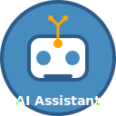
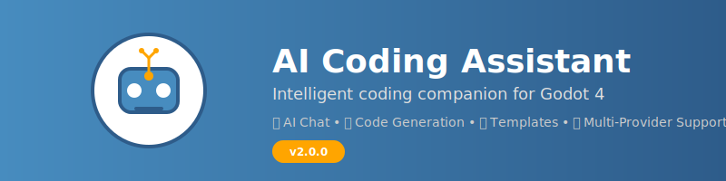
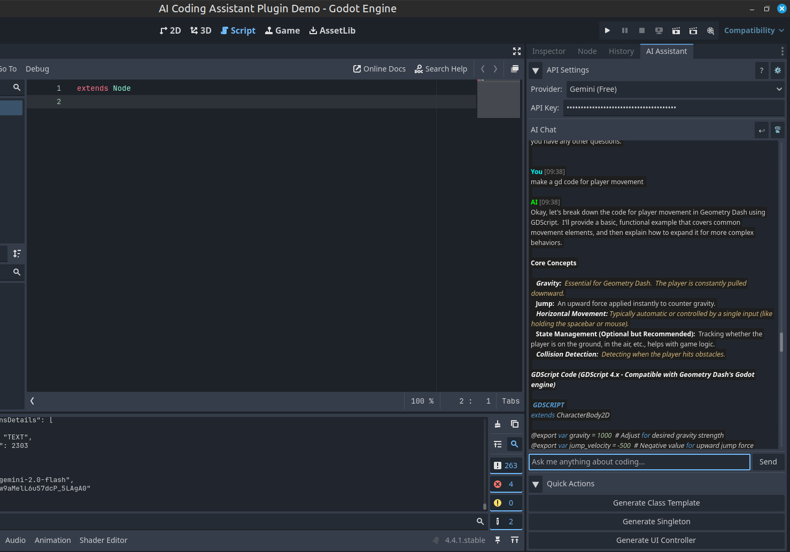

<div align="center">
  

  # 🤖 AI Agent for Godot 4 [v3.0.0] - The Agent Revolution

  [](https://godotengine.org/)
  [](https://opensource.org/licenses/MIT)
  [](https://github.com/Godot4-Addons/ai_agent_for_godot4/releases)
  [](https://github.com/Godot4-Addons/ai_agent_for_godot4)
  [](DONATIONS.md)
</div>

🚀 **The World's First Autonomous AI Coding Agent for Godot** - A revolutionary plugin that transforms game development with autonomous error fixing, intelligent task management, real-time terminal monitoring, and advanced codebase analysis.

<div align="center">
  
</div>



## 🚀 **Revolutionary AI Agent Features**

### 🤖 **Autonomous AI Agent**
- **Self-Operating**: Works independently to solve coding problems
- **Goal-Oriented**: Set high-level goals and watch the agent work
- **Learning Capability**: Improves from experience and user feedback
- **Multi-Provider AI**: Support for OpenAI, Anthropic, Gemini, Cohere, Ollama, and more

### 🔧 **Autonomous Error Fixing**
- **Real-time Error Detection**: Monitors terminal output for errors
- **Automatic Fixes**: Applies fixes for common errors without user intervention
- **Smart Pattern Recognition**: Learns from previous fixes
- **Confidence-based Decisions**: Only applies fixes when confident

### 📺 **Terminal Integration**
- **Command Execution**: Execute terminal commands directly from the agent
- **Output Monitoring**: Real-time monitoring of terminal output
- **Error Pattern Detection**: Advanced regex-based error detection
- **Build Process Integration**: Monitors compilation and runtime errors

### 🧠 **Advanced Codebase Analysis**
- **Project Structure Understanding**: Deep analysis of entire codebase
- **Dependency Graph**: Visual representation of code dependencies
- **Performance Analysis**: Identifies bottlenecks and optimization opportunities
- **Code Quality Metrics**: Comprehensive code quality assessment
### 📋 **Intelligent Task Management**
- **Goal-Oriented Planning**: Break down complex goals into actionable tasks
- **Priority-based Scheduling**: Intelligent task prioritization and execution
- **Dependency Management**: Handle task dependencies automatically
- **Progress Tracking**: Monitor agent performance and success rates

### 🧠 **Agent Memory & Learning**
- **Persistent Memory**: Remembers errors, solutions, and patterns
- **Pattern Recognition**: Learns from successful fixes and approaches
- **Context Awareness**: Understands project structure and coding patterns
- **Continuous Improvement**: Gets better with each interaction

## 📁 **Project Structure**

The AI Agent is organized with a clean, modular architecture:

```
addons/ai_coding_assistant/
├── core/                    # 🧠 Core AI Agent Intelligence
│   ├── agent_brain.gd      # Central decision-making system
│   ├── task_manager.gd     # Task scheduling and execution
│   ├── agent_memory.gd     # Learning and context management
│   ├── terminal_integration.gd # Terminal monitoring
│   ├── auto_error_fixer.gd # Autonomous error fixing
│   └── advanced_code_analyzer.gd # Codebase analysis
├── ai/                     # 🤖 AI Provider Integration
│   ├── ai_api_manager.gd   # Multi-provider management
│   ├── ai_ollama.gd        # Ollama integration
│   └── ai_utils.gd         # AI utilities
├── ui/                     # 🖥️ User Interface
│   ├── ai_assistant_dock.gd # Main interface
│   ├── settings_dialog.gd  # Configuration
│   ├── diff_viewer.gd      # Code diff viewer
│   └── setup_guide.gd     # Setup wizard
├── utils/                  # 🔧 Utilities
│   ├── editor_integration.gd # Godot editor integration
│   ├── code_templates.gd   # Code templates
│   ├── code_analyzer.gd    # Code analysis
│   └── default_config.gd   # Default settings
├── models/                 # 📊 Data Models
│   └── chat_message.gd    # Message structure
├── docs/                   # 📚 Documentation
│   ├── ARCHITECTURE.md     # Technical architecture
│   ├── CHANGELOG.md        # Version history
│   └── README.md          # Detailed documentation
└── assets/                 # 🎨 Visual Assets
    └── plugin_icon.svg    # Plugin icon
```

## 🚀 **Quick Start**

### 1. **Installation**
```bash
# Clone the repository
git clone https://github.com/Godot4-Addons/ai_agent_for_godot4.git

# Copy to your project
cp -r ai_agent_for_godot4/addons/ai_coding_assistant your_project/addons/
```

### 2. **Enable Plugin**
1. Open your Godot project
2. Go to **Project Settings > Plugins**
3. Find **AI Agent for Godot** and enable it
4. The AI Agent dock will appear in the left panel

### 3. **Configure AI Provider**
1. Click the **⚙ Settings** button in the AI Agent dock
2. Select your preferred AI provider (OpenAI, Anthropic, Gemini, etc.)
3. Enter your API key
4. **Enable Agent Mode** for autonomous operation

### 4. **Start Using the Agent**
- **Set Goals**: Give the agent high-level objectives
- **Monitor Progress**: Watch the agent work autonomously
- **Review Changes**: Agent shows all modifications before applying
- **Learn Together**: Agent improves from your feedback

## 📚 **Documentation**

### 🚀 **Agent Documentation**
- **[Architecture Guide](addons/ai_coding_assistant/docs/ARCHITECTURE.md)** - Technical architecture and design
- **[Agent User Guide](addons/ai_coding_assistant/docs/README.md)** - Complete user documentation
- **[Changelog](addons/ai_coding_assistant/docs/CHANGELOG.md)** - Version history and updates
- **[Editor Integration](addons/ai_coding_assistant/docs/EDITOR_INTEGRATION_GUIDE.md)** - Editor integration details

### 🤖 **Agent Features**
- **Autonomous Operation** - Set goals and let the agent work independently
- **Error Auto-Fixing** - Automatically detects and fixes common coding errors
- **Terminal Integration** - Real-time monitoring and command execution
- **Codebase Analysis** - Deep understanding of project structure and dependencies
- **Learning System** - Improves performance through experience and feedback

### 🔧 **Technical Features**
- **Multi-AI Provider Support** - OpenAI, Anthropic, Gemini, Cohere, Ollama
- **Modular Architecture** - Clean separation of concerns for easy maintenance
- **Professional UI** - Responsive design with enhanced markdown support
- **Cross-Platform** - Works seamlessly across different operating systems

## 🎯 **Agent Capabilities**

### **🤖 Autonomous Operation**
- **Goal-Oriented Planning**: Set high-level objectives and let the agent work
- **Task Decomposition**: Automatically breaks down complex goals into actionable tasks
- **Independent Execution**: Works autonomously while you focus on other tasks
- **Progress Monitoring**: Real-time updates on agent activities and progress

### **🔧 Intelligent Error Fixing**
- **Real-time Detection**: Monitors terminal output for errors and warnings
- **Pattern Recognition**: Learns from previous fixes to improve accuracy
- **Automatic Application**: Applies fixes with confidence-based decision making
- **Backup Creation**: Creates backups before making any changes

### **📺 Terminal Integration**
- **Command Execution**: Execute terminal commands directly from the agent
- **Output Analysis**: Real-time parsing of build and runtime output
- **Error Classification**: Categorizes errors by type and severity
- **Build Monitoring**: Tracks compilation and deployment processes

### **🧠 Advanced Analysis**
- **Project Understanding**: Deep analysis of entire codebase structure
- **Dependency Mapping**: Visual representation of code dependencies
- **Performance Insights**: Identifies optimization opportunities
- **Quality Metrics**: Comprehensive code quality assessment

## 🎮 **Agent Usage Examples**

### **Setting Agent Goals**
```
🎯 Goal: "Fix all compilation errors in the project"
📋 Agent creates tasks:
  1. Analyze project for errors
  2. Categorize errors by type
  3. Apply appropriate fixes
  4. Verify fixes work correctly
```

### **Autonomous Error Fixing**
```
📺 Terminal Output: "ERROR: Identifier 'player_speed' not declared"
🤖 Agent Response:
  1. Detects undefined variable error
  2. Analyzes context and usage
  3. Adds proper variable declaration
  4. Creates backup before applying fix
```

### **Codebase Analysis**
```
📊 Project Analysis Results:
  - 🏗️ Structure: 45 scripts, 12 scenes
  - 🔗 Dependencies: 3 circular dependencies found
  - 📈 Metrics: 85% maintainability score
  - ⚡ Performance: 2 optimization opportunities
```

## 🔧 **AI Provider Support**

### **OpenAI** (Recommended for Agents)
- **Models**: GPT-4, GPT-4 Turbo, GPT-3.5 Turbo
- **Features**: Excellent reasoning, reliable for autonomous tasks
- **Setup**: Get API key from OpenAI Platform

### **Anthropic Claude**
- **Models**: Claude-3 Opus, Sonnet, Haiku
- **Features**: Superior code understanding, safety-focused
- **Setup**: Get API key from Anthropic Console

### **Google Gemini**
- **Models**: Gemini Pro, Gemini Flash
- **Features**: Fast, cost-effective, good for analysis
- **Setup**: Get API key from Google AI Studio

### **Ollama** (Local AI)
- **Models**: Llama, CodeLlama, Mistral, and more
- **Features**: Privacy-focused, runs locally, no API costs
- **Setup**: Install Ollama and download models locally

### **Cohere & Others**
- **Multiple Providers**: Groq, HuggingFace, and more
- **Features**: Specialized models for different use cases
- **Setup**: Provider-specific API keys

## 🛠️ **Development**

### **Requirements**
- Godot 4.x (4.0 or later)
- Internet connection for AI features
- API key from supported provider

### **Building from Source**
```bash
# Clone repository
git clone https://github.com/Godot4-Addons/ai_agent_for_godot4.git
cd ai_agent_for_godot4

# Test the agent components
godot --headless --script test/run_agent_tests.gd

# Install in your project
cp -r addons/ai_coding_assistant /path/to/your/project/addons/
```

### **Contributing**
1. Fork the repository
2. Create a feature branch
3. Make your changes
4. Add tests for new features
5. Submit a pull request

## 📊 **Agent Statistics**

- **🤖 6 Core Modules**: Complete autonomous agent architecture
- **🔧 5+ AI Providers**: OpenAI, Anthropic, Gemini, Ollama, and more
- **🧠 4 Intelligence Systems**: Brain, Memory, Tasks, Analysis
- **📺 Real-time Monitoring**: Terminal integration and error detection
- **🎯 Autonomous Operation**: Goal-oriented task execution
- **📁 Professional Structure**: Modular, maintainable codebase
- **🔄 Continuous Learning**: Improves with each interaction

## 🤝 **Community**

- **GitHub Issues**: [Report bugs and request features](https://github.com/Godot4-Addons/ai_agent_for_godot4/issues)
- **Discussions**: [Join the community discussion](https://github.com/Godot4-Addons/ai_agent_for_godot4/discussions)
- **Wiki**: [Community-maintained documentation](https://github.com/Godot4-Addons/ai_agent_for_godot4/wiki)
- **Agent Development**: [Contribute to agent intelligence](https://github.com/Godot4-Addons/ai_agent_for_godot4/blob/main/addons/ai_coding_assistant/docs/ARCHITECTURE.md)

## 💝 **Support Development**

If this AI Agent has helped improve your game development workflow, consider supporting its continued development:

### **Cryptocurrency Donations**
- **Binance Pay ID**: `1010167458`
- **Bybit UID**: `389218671`

### **Other Ways to Support**
- ⭐ **Star the Repository**: Help others discover this project
- 🐛 **Report Issues**: Help improve the agent's reliability
- 📝 **Contribute Code**: Add new features or fix bugs
- 📚 **Improve Documentation**: Help other developers get started
- 💬 **Share Your Experience**: Tell others about the AI Agent

Your support helps maintain and improve this revolutionary tool for the Godot community! 🚀

## 📄 **License**

This project is licensed under the MIT License - see the [LICENSE](LICENSE) file for details.

## 🙏 **Acknowledgments**

- **Godot Engine**: For the amazing game engine and development platform
- **AI Providers**: OpenAI, Anthropic, Google, and others for AI capabilities
- **Community**: Contributors and users who make this project better
- **Open Source**: The incredible open-source ecosystem that makes this possible

---

<div align="center">

**🤖 Made with ❤️ for the Godot community**

*Experience the future of game development with autonomous AI assistance!*

**🚀 The World's First AI Agent for Godot 4 🚀**

**💝 Support Development**: [Binance Pay `1010167458`](DONATIONS.md) | [Bybit UID `389218671`](DONATIONS.md)

</div>
