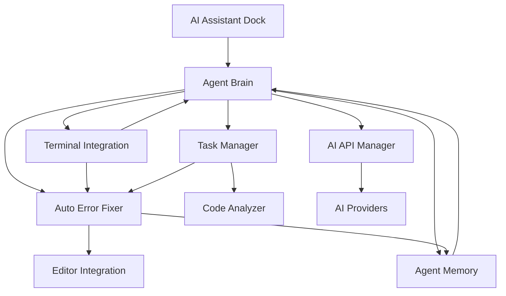

# AI Agent for Godot - Architecture Documentation

## 🏗️ **Project Structure**

```
addons/ai_coding_assistant/
├── core/                           # Core AI Agent Components
│   ├── agent_brain.gd             # Central decision-making system
│   ├── task_manager.gd            # Task scheduling and execution
│   ├── agent_memory.gd            # Learning and context management
│   ├── terminal_integration.gd    # Terminal monitoring and command execution
│   ├── auto_error_fixer.gd        # Autonomous error detection and fixing
│   └── advanced_code_analyzer.gd  # Deep codebase analysis
├── ai/                            # AI Provider Integration
│   ├── ai_api_manager.gd          # Multi-provider AI API management
│   └── providers/                 # Individual AI provider implementations
├── ui/                            # User Interface Components
│   ├── ai_assistant_dock.gd       # Main dock interface
│   ├── settings_dialog.gd         # Configuration dialog
│   └── diff_viewer.gd             # Code diff visualization
├── utils/                         # Utility Functions
│   ├── ai_utils.gd                # AI-related utilities
│   ├── code_templates.gd          # Code template system
│   └── editor_integration.gd     # Godot editor integration
├── models/                        # Data Models
│   └── chat_message.gd           # Chat message data structure
├── plugin.gd                     # Main plugin entry point
├── plugin.cfg                    # Plugin configuration
├── README.md                     # Documentation
├── CHANGELOG.md                  # Version history
└── ARCHITECTURE.md               # This file
```

## 🧠 **Core Agent Architecture**

### **Agent Brain** (`core/agent_brain.gd`)
The central intelligence that coordinates all agent activities.

**Responsibilities:**
- Goal-oriented decision making
- Task decomposition and planning
- Component coordination
- Performance monitoring
- Learning from experience

**Key Features:**
- Autonomous and manual operation modes
- Intelligent task breakdown
- Context-aware decision making
- Performance metrics tracking

### **Task Manager** (`core/task_manager.gd`)
Handles intelligent task scheduling and execution.

**Responsibilities:**
- Task queue management
- Priority-based scheduling
- Dependency resolution
- Timeout handling
- Retry mechanisms

**Key Features:**
- Concurrent task execution
- Dependency management
- Automatic retry on failure
- Comprehensive task lifecycle

### **Agent Memory** (`core/agent_memory.gd`)
Persistent learning and context management system.

**Responsibilities:**
- Error and solution storage
- Pattern recognition
- Context management
- Learning from experience
- Disk persistence

**Key Features:**
- Categorized memory storage
- Similarity-based retrieval
- Pattern learning
- Persistent storage

### **Terminal Integration** (`core/terminal_integration.gd`)
Real-time terminal monitoring and command execution.

**Responsibilities:**
- Terminal output monitoring
- Command execution
- Error pattern detection
- Warning identification
- Output analysis

**Key Features:**
- Real-time monitoring
- Regex-based pattern matching
- Command execution with result tracking
- Configurable detection patterns

### **Auto Error Fixer** (`core/auto_error_fixer.gd`)
Autonomous error detection and fixing system.

**Responsibilities:**
- Error classification
- Fix pattern matching
- Automatic fix application
- Backup creation
- Fix validation

**Key Features:**
- Confidence-based fixing
- Pattern-based solutions
- Backup before fixes
- Success tracking

### **Advanced Code Analyzer** (`core/advanced_code_analyzer.gd`)
Deep codebase analysis and understanding.

**Responsibilities:**
- Project structure analysis
- Dependency graph generation
- Code quality metrics
- Performance analysis
- Recommendation generation

**Key Features:**
- Comprehensive project analysis
- Dependency cycle detection
- Code quality assessment
- Performance recommendations

## 🔄 **Component Interaction Flow**



## 🎯 **Agent Operation Modes**

### **Manual Mode**
- User-initiated actions
- Interactive assistance
- Manual task execution
- User-controlled decisions

### **Autonomous Mode**
- Self-operating behavior
- Automatic error fixing
- Goal-oriented task execution
- Independent decision making

## 📊 **Data Flow**

### **Error Detection Flow**
1. Terminal Integration detects error patterns
2. Error information sent to Agent Brain
3. Agent Brain classifies and prioritizes error
4. Auto Error Fixer analyzes and applies fix
5. Result stored in Agent Memory for learning

### **Task Execution Flow**
1. Goal set in Agent Brain
2. Goal decomposed into tasks
3. Tasks added to Task Manager queue
4. Task Manager executes tasks based on priority
5. Results fed back to Agent Brain
6. Learning patterns stored in Agent Memory

### **Code Analysis Flow**
1. Advanced Code Analyzer scans project
2. Dependency graph and metrics calculated
3. Issues and recommendations generated
4. Results cached for future use
5. Insights provided to Agent Brain for decision making

## 🔧 **Configuration System**

### **Agent Settings**
- Auto mode enable/disable
- Confidence thresholds
- Task concurrency limits
- Learning parameters

### **Error Fixing Settings**
- Auto-fix enable/disable
- Backup creation
- Fix testing
- Pattern confidence levels

### **Memory Settings**
- Memory limits per category
- Persistence enable/disable
- Learning thresholds
- Pattern recognition sensitivity

## 🚀 **Extension Points**

### **Custom Task Executors**
Add new task types by implementing executor functions in Task Manager.

### **Error Fix Patterns**
Extend error fixing capabilities by adding new patterns to Auto Error Fixer.

### **Analysis Modules**
Enhance code analysis by adding new analysis modules to Advanced Code Analyzer.

### **AI Providers**
Add support for new AI services by implementing provider interfaces.

## 🔒 **Security Considerations**

### **File Operations**
- Backup creation before modifications
- Validation of file paths
- Permission checking

### **Command Execution**
- Sandboxed execution environment
- Command validation
- Output sanitization

### **AI Integration**
- API key security
- Request/response validation
- Rate limiting

## 📈 **Performance Optimization**

### **Caching Strategy**
- Analysis result caching
- Pattern matching optimization
- Memory usage limits

### **Async Operations**
- Non-blocking task execution
- Async AI API calls
- Background monitoring

### **Resource Management**
- Memory cleanup
- Timer management
- Component lifecycle

## 🧪 **Testing Strategy**

### **Unit Testing**
- Individual component testing
- Mock dependencies
- Edge case coverage

### **Integration Testing**
- Component interaction testing
- End-to-end workflows
- Error scenario testing

### **Performance Testing**
- Memory usage monitoring
- Response time measurement
- Concurrent operation testing

This architecture provides a robust, extensible foundation for the AI Agent system while maintaining clean separation of concerns and enabling future enhancements.
