<div align="center">
  

  # AI Agent for Godot 4

  🤖 **The World's First Autonomous AI Coding Agent for Godot**
  Advanced AI agent with autonomous error fixing, terminal integration, codebase analysis, and intelligent task management.
</div>

## 🚀 **Revolutionary AI Agent Features**

### 🤖 **Autonomous AI Agent**
- **Self-Operating**: Works independently to solve coding problems
- **Goal-Oriented**: Set high-level goals and watch the agent work
- **Learning Capability**: Improves from experience and user feedback
- **Multi-Provider AI**: Support for Google Gemini, OpenAI, Anthropic, Cohere, Ollama, and more

### 🔧 **Autonomous Error Fixing**
- **Real-time Error Detection**: Monitors terminal output for errors
- **Automatic Fixes**: Applies fixes for common errors without user intervention
- **Smart Pattern Recognition**: Learns from previous fixes
- **Confidence-based Decisions**: Only applies fixes when confident

### 📺 **Terminal Integration**
- **Command Execution**: Execute terminal commands directly from the agent
- **Output Monitoring**: Real-time monitoring of terminal output
- **Error Pattern Detection**: Advanced regex-based error detection
- **Build Process Integration**: Monitors compilation and runtime errors

### 🧠 **Advanced Codebase Analysis**
- **Project Structure Understanding**: Deep analysis of entire codebase
- **Dependency Graph**: Visual representation of code dependencies
- **Performance Analysis**: Identifies bottlenecks and optimization opportunities
- **Code Quality Metrics**: Comprehensive code quality assessment

### 🎨 **Modern UI**
- **Responsive Design**: Adapts to any screen size
- **Flexible Layout**: Resizable panels and collapsible sections
- **Dark Theme**: Easy on the eyes during long coding sessions
- **Keyboard Shortcuts**: Efficient workflow with hotkeys

### 🔧 **Developer Experience**
- **Easy Setup**: One-click installation and configuration
- **Persistent Settings**: Your preferences are saved automatically
- **Code Diff Viewer**: Review AI-generated changes before applying
- **Export/Import**: Save and share code snippets

## 🚀 Quick Start

### 1. Installation

#### Option A: From Godot Asset Library (Recommended)
1. Open Godot 4.x
2. Go to **AssetLib** tab
3. Search for "AI Coding Assistant"
4. Click **Download** and **Install**

#### Option B: Manual Installation
1. Download the latest release from GitHub
2. Extract to your project's `addons/` folder
3. Enable the plugin in **Project Settings > Plugins**

## 📁 **Project Structure**

The plugin is organized into logical modules:

- **`core/`** - Core AI agent intelligence and automation
- **`ai/`** - AI provider integrations and utilities
- **`ui/`** - User interface components and dialogs
- **`utils/`** - Utility functions and editor integration
- **`models/`** - Data models and structures
- **`docs/`** - Documentation and guides
- **`assets/`** - Icons and visual assets

### 2. Setup

1. **Enable Plugin**: Go to Project Settings > Plugins and enable "AI Coding Assistant"
2. **Get API Key**: 
   - For Gemini (recommended): Visit [Google AI Studio](https://makersuite.google.com/app/apikey)
   - For Hugging Face: Visit [HF Tokens](https://huggingface.co/settings/tokens)
   - For Cohere: Visit [Cohere Dashboard](https://dashboard.cohere.ai/api-keys)
3. **Configure**: Open the AI Assistant dock and enter your API key
4. **Test**: Send a message like "Hello, can you help me with GDScript?"

### 3. First Steps

Try these examples to get started:

```
"Create a simple player movement script"
"Explain how signals work in Godot"
"Generate a save/load system"
"Help me optimize this function"
```

## 📖 Usage Guide

### Basic Chat
- Type your question in the input field
- Press **Enter** to send
- AI responses appear in the chat area
- Code responses are automatically formatted

### Quick Actions
Use pre-built templates for common tasks:
- **Player Movement**: 2D/3D character controllers
- **UI Controller**: Menu and interface management
- **Save System**: Game state persistence
- **Audio Manager**: Sound and music control
- **State Machine**: AI and game state management

### Code Operations
- **Explain**: Select code and click "Explain" for detailed explanations
- **Improve**: Get optimization suggestions for selected code
- **Apply**: Insert AI-generated code into your script
- **Diff View**: Review changes before applying them

### Keyboard Shortcuts
- `Enter`: Send message
- `Ctrl+Enter`: Apply generated code
- `Ctrl+L`: Clear chat history
- `Ctrl+E`: Explain selected code
- `Ctrl+R`: Improve selected code
- `Ctrl+I`: Focus input field

## ⚙️ Configuration

### API Providers

#### Google Gemini (Recommended)
- **Free Tier**: 60 requests/minute, 1500/day
- **Best For**: Code generation and explanations
- **Models**: gemini-1.5-flash, gemini-1.5-pro

#### Hugging Face
- **Free Tier**: 30 requests/minute, 1000/day
- **Best For**: Open-source models
- **Models**: Various coding-focused models

#### Cohere
- **Free Tier**: 20 requests/minute, 100/day
- **Best For**: Advanced text generation
- **Models**: command, command-light

### Settings
- **Temperature**: Controls AI creativity (0.0-1.0)
- **Max Tokens**: Maximum response length
- **Auto-suggest**: Enable real-time suggestions
- **Save History**: Persist chat conversations

## 🎮 Game Development Templates

### Player Movement
```gdscript
extends CharacterBody2D

@export var speed: float = 300.0
@export var jump_velocity: float = -400.0

func _physics_process(delta):
    # Handle movement and physics
    # Generated by AI Assistant
```

### Save System
```gdscript
extends Node

func save_game(data: Dictionary):
    # Robust save/load implementation
    # Generated by AI Assistant
```

### UI Controller
```gdscript
extends Control

func show_menu(menu: Control):
    # Menu management system
    # Generated by AI Assistant
```

## 🔧 Troubleshooting

### Common Issues

**Plugin not appearing?**
- Ensure Godot 4.x is being used
- Check that plugin is enabled in Project Settings
- Restart Godot after installation

**API errors?**
- Verify your API key is correct
- Check internet connection
- Ensure you haven't exceeded rate limits

**Code not applying?**
- Make sure a script is open in the editor
- Check that the generated code is valid GDScript
- Try using the diff viewer to review changes

### Getting Help
- Check the built-in setup guide
- Review example prompts and templates
- Join the community discussions
- Report bugs on GitHub

## 🤝 Contributing

We welcome contributions! Here's how to help:

1. **Fork** the repository
2. **Create** a feature branch
3. **Make** your changes
4. **Add** tests for new features
5. **Submit** a pull request

### Development Setup
```bash
git clone https://github.com/godot4-addons/ai_assistant_for_godot4.git
cd ai_assistant_for_godot4
# Open in Godot 4.x for testing
```

## 📄 License

This project is licensed under the MIT License - see the [LICENSE](LICENSE) file for details.

## 🙏 Acknowledgments

- Godot Engine team for the amazing game engine
- AI providers for making powerful models accessible
- Community contributors and testers
- Open source projects that inspired this plugin

---

**Happy Coding with AI! 🚀**
